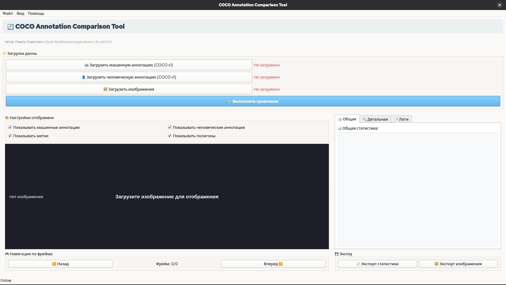

# COCO Annotation Comparison Tool

## 📋 Описание

Минималистичное приложение для сравнения машинных и человеческих аннотаций в формате COCO v1. Приложение предоставляет визуальное сравнение аннотаций, расчет статистики и метрик качества в одном исполняемом файле.

**Автор:** Равиль Рависович  
**Email:** RavilRavisovich@gmail.com  
**Идентификатор:** @X5373

## ✨ Особенности

- **Полная поддержка COCO v1**: Загрузка и парсинг JSON файлов
- **Визуальное сравнение**: Цветовое разделение машинных (красный) и человеческих (зеленый) аннотаций
- **Отображение полигонов**: Полупрозрачные полигоны сегментации
- **Интерактивный интерфейс**: Масштабирование, панорамирование, навигация по фреймам
- **Статистика**: Расчет Precision, Recall, F1 Score
- **Экспорт**: Сохранение статистики и изображений с аннотациями
- **Минимальные зависимости**: Все в одном файле

## 🚀 Быстрый старт

### Установка зависимостей

```bash
pip install PyQt6 pillow numpy
```

### Запуск приложения

```bash
python coco_comparison_single.py
```

## 🎨 Интерфейс приложения

### Главное окно


1. **Панель загрузки**: Кнопки загрузки аннотаций и изображений
2. **Просмотр изображений**: Область отображения с аннотациями
3. **Настройки отображения**: Чекбоксы для управления видимостью
4. **Навигация**: Кнопки перехода между фреймами
5. **Статистика**: Вкладки с общей и детальной статистикой
6. **Логи**: Журнал выполнения операций
7. **Экспорт**: Кнопки сохранения результатов

## 📊 Функциональность

### Загрузка данных
- **Машинные аннотации**: COCO v1 JSON файл с автоматическим парсингом
- **Человеческие аннотации**: COCO v1 JSON файл для сравнения
- **Изображения**: Поддержка форматов JPG, PNG, BMP, TIFF

### Отображение аннотаций
- **Bounding boxes**: Цветные прямоугольники с метками
- **Полигоны сегментации**: Полупрозрачная заливка
- **Цветовая схема**:
  - 🔴 **Красный** - машинные аннотации (M)
  - 🟢 **Зеленый** - человеческие аннотации (H)
- **Метки**: ID категории и уверенность

### Управление отображением
- **Масштабирование**: Колесико мыши
- **Панорамирование**: Перетаскивание левой кнопкой мыши
- **Фильтрация**: Включение/выключение типов аннотаций
- **Автомасштабирование**: Подгонка под размер окна

### Анализ и статистика
- **Общая статистика**: Количественные показатели
- **Метрики качества**:
  - **Precision** (Точность): Доля правильных обнаружений
  - **Recall** (Полнота): Доля найденных объектов
  - **F1 Score**: Гармоническое среднее
- **Детальная статистика**: Информация по текущему фрейму

## 📁 Структура данных COCO v1

### Пример формата файла аннотаций
```json
{
  "info": {
    "description": "Dataset description",
    "version": "1.0",
    "year": 2023
  },
  "images": [
    {
      "id": 1,
      "file_name": "image1.jpg",
      "width": 800,
      "height": 600
    }
  ],
  "annotations": [
    {
      "id": 1,
      "image_id": 1,
      "category_id": 1,
      "bbox": [100, 100, 200, 150],
      "segmentation": [[100, 100, 300, 100, 300, 250, 100, 250]],
      "area": 30000,
      "iscrowd": 0,
      "confidence": 0.95
    }
  ],
  "categories": [
    {
      "id": 1,
      "name": "person",
      "supercategory": "human"
    }
  ]
}
```

## 🔧 Использование

### Пошаговая инструкция

1. **Запустите приложение**
   ```bash
   python coco_comparison_single.py
   ```

2. **Загрузите машинные аннотации**
   - Нажмите "🤖 Загрузить машинную аннотацию"
   - Выберите JSON файл в формате COCO v1

3. **Загрузите человеческие аннотации**
   - Нажмите "👤 Загрузить человеческую аннотацию"
   - Выберите JSON файл для сравнения

4. **Загрузите изображения**
   - Нажмите "🖼️ Загрузить изображения"
   - Выберите папку с изображениями

5. **Выполните сравнение**
   - Нажмите "⚡ Выполнить сравнение"
   - Дождитесь расчета статистики

6. **Просматривайте результаты**
   - Используйте навигацию для перехода между фреймами
   - Включайте/выключайте типы аннотаций
   - Изучайте статистику во вкладках

7. **Экспортируйте результаты**
   - Сохраните статистику в текстовый файл
   - Экспортируйте текущее изображение с аннотациями

### Горячие клавиши
- **Меню Файл**: Загрузка и экспорт данных
- **Меню Вид**: Управление масштабом
- **Мышь**: Масштабирование и панорамирование
- **Навигация**: Кнопки "Назад"/"Вперед"

## 📈 Метрики качества

### Формулы расчета

**Precision (Точность):**
```
Precision = Matches / Total Machine Annotations
```

**Recall (Полнота):**
```
Recall = Matches / Total Human Annotations
```

**F1 Score:**
```
F1 = 2 * (Precision * Recall) / (Precision + Recall)
```

### Интерпретация результатов

| F1 Score | Качество | Рекомендация |
|----------|----------|--------------|
| ≥ 0.8 | Отличное 🎉 | Аннотации высокого качества |
| 0.6-0.8 | Хорошее 👍 | Незначительные улучшения |
| 0.4-0.6 | Удовлетворительное ⚠️ | Требуется доработка |
| < 0.4 | Низкое 🚨 | Существенные проблемы |

## 🐛 Отладка и устранение неполадок

### Проблема: Не отображаются полигоны
**Решение:**
1. Проверьте формат поля `segmentation` в JSON
2. Убедитесь, что данные не пустые
3. Проверьте корректность координат

### Проблема: Изображение не загружается
**Решение:**
1. Проверьте путь к файлу
2. Убедитесь, что формат поддерживается
3. Проверьте права доступа

### Проблема: Статистика не рассчитывается
**Решение:**
1. Убедитесь, что загружены оба набора аннотаций
2. Проверьте соответствие image_id
3. Проверьте формат bounding boxes

## 📝 Пример использования в пайплайне

```python
# Пример интеграции с внешними системами
# (Приложение может быть расширено для использования как библиотека)

# Загрузка данных через JSON API
import json

def prepare_data_for_comparison():
    """Подготовка данных для сравнения."""
    data = {
        "machine_annotations": "path/to/machine.json",
        "human_annotations": "path/to/human.json",
        "images_dir": "path/to/images"
    }
    
    with open("comparison_config.json", "w") as f:
        json.dump(data, f)
    
    return "comparison_config.json"
```

## 🔄 Поддерживаемые форматы

### Входные форматы
- **Аннотации**: JSON (COCO v1)
- **Изображения**: JPG, JPEG, PNG, BMP, TIFF

### Выходные форматы
- **Статистика**: TXT (текстовый файл)
- **Изображения**: PNG, JPG

## 📊 Пример отчета

```
============================================================
COCO ANNOTATION COMPARISON STATISTICS
============================================================

Author: Равиль Рависович
Email: RavilRavisovich@gmail.com
ID: @X5373

SUMMARY:
• Total Images: 100
• Machine Annotations: 450
• Human Annotations: 420

COMPARISON RESULTS:
• Matches: 380
• Mismatches: 70
• Missing: 40
• Extra: 50

QUALITY METRICS:
• Precision: 0.844
• Recall: 0.905
• F1 Score: 0.873
```
# COCO Annotation Comparison Tool - Детальное описание метрик и алгоритмов

## 📊 **ПОЛНОЕ ОПИСАНИЕ МЕТРИК И ФОРМУЛ**

### **1. ОСНОВНЫЕ КОНЦЕПЦИИ И ТЕРМИНЫ**

#### **Определения:**
- **True Positive (TP, Истинно положительные)** - Машинные аннотации, которые корректно совпали с человеческими
- **False Positive (FP, Ложно положительные)** - Машинные аннотации, которые НЕ совпали с человеческими (лишние)
- **False Negative (FN, Ложно отрицательные)** - Человеческие аннотации, которые НЕ найдены машинными (пропущенные)
- **Intersection over Union (IoU, Пересечение над объединением)** - Мера пересечения двух областей

---

### **2. ДЕТАЛЬНЫЕ ФОРМУЛЫ РАСЧЕТА**

#### **2.1. IoU (Intersection over Union) - Пересечение над объединением**

**Формула:**
```
IoU(A, B) = Area(A ∩ B) / Area(A ∪ B)
```

**Где:**
- `A` - bounding box машинной аннотации
- `B` - bounding box человеческой аннотации
- `A ∩ B` - область пересечения
- `A ∪ B` - область объединения

**Визуализация:**
```
┌──────────────┐
│  A           │
│   ┌──────┐   │
│   │ A∩B  │   │
│   └──────┘   │
└──────────────┘
        ┌──────┐
        │  B   │
        └──────┘
```

**Пример расчета:**
```
A: [100, 100, 200, 150]  # x, y, width, height
B: [120, 120, 180, 130]

Площадь A = 200 * 150 = 30,000
Площадь B = 180 * 130 = 23,400

Пересечение:
x_overlap = max(0, min(300, 300) - max(100, 120)) = 180
y_overlap = max(0, min(250, 250) - max(100, 120)) = 130
Площадь пересечения = 180 * 130 = 23,400

Объединение = 30,000 + 23,400 - 23,400 = 30,000
IoU = 23,400 / 30,000 = 0.78
```

**Пороговые значения:**
- `IoU ≥ 0.5` - Сильное совпадение ✓
- `0.3 ≤ IoU < 0.5` - Частичное совпадение ⚠️  
- `IoU < 0.3` - Несовпадение ✗

---

#### **2.2. Precision (Точность, PPV - Positive Predictive Value)**

**Формула:**
```
Precision = TP / (TP + FP) = Правильные обнаружения / Все обнаружения машины
```

**Интерпретация:**
- **Что измеряет:** Насколько машинные аннотации точны
- **Когда важна:** Когда ложные срабатывания критичны
- **Пример:** Если Precision = 0.85, значит 85% машинных аннотаций корректны

**Детальный расчет:**
```
TP = ∑[для всех машинных аннотаций: IoU(машина, человек) ≥ порог]
FP = ∑[для всех машинных аннотаций: НЕТ человеческой аннотации с IoU ≥ порог]
Precision = TP / (TP + FP)
```

**Пример:**
```
Всего машинных аннотаций: 100
Совпало с человеческими (TP): 80
Не совпало (FP): 20
Precision = 80 / (80 + 20) = 0.80
```

---

#### **2.3. Recall (Полнота, Sensitivity, True Positive Rate)**

**Формула:**
```
Recall = TP / (TP + FN) = Найденные объекты / Все существующие объекты
```

**Интерпретация:**
- **Что измеряет:** Насколько полно машина находит все объекты
- **Когда важна:** Когда пропущенные объекты критичны  
- **Пример:** Если Recall = 0.90, значит машина находит 90% всех объектов

**Детальный расчет:**
```
TP = ∑[для всех человеческих аннотаций: ∃ машинная аннотация с IoU ≥ порог]
FN = ∑[для всех человеческих аннотаций: НЕТ машинной аннотации с IoU ≥ порог]
Recall = TP / (TP + FN)
```

**Пример:**
```
Всего человеческих аннотаций: 100
Найдено машиной (TP): 85
Пропущено машиной (FN): 15  
Recall = 85 / (85 + 15) = 0.85
```

---

#### **2.4. F1 Score (Гармоническое среднее)**

**Формула:**
```
F1 = 2 * (Precision * Recall) / (Precision + Recall)
```

**Математическое обоснование:**
```
F1 = 1 / [ (1/Precision + 1/Recall) / 2 ] = Гармоническое среднее
```

**Почему именно гармоническое среднее:**
- Арифметическое среднее: `(P + R) / 2` - одинаково вес
- Гармоническое среднее: `2PR/(P+R)` - наказывает за дисбаланс

**Пример:**
```
Precision = 0.80, Recall = 0.85
Арифметическое среднее = (0.80 + 0.85) / 2 = 0.825
Гармоническое среднее (F1) = 2 * 0.80 * 0.85 / (0.80 + 0.85) = 0.824
```

**Случай дисбаланса:**
```
Precision = 0.95, Recall = 0.55
Арифметическое среднее = 0.75
Гармоническое среднее (F1) = 0.696  <- Сильнее наказывает!
```

---

### **3. АЛГОРИТМ СРАВНЕНИЯ ПОШАГОВО**

#### **Шаг 1: Подготовка данных**
```
Для каждой аннотации:
    - Нормализация bounding box: [x, y, width, height] → [x_min, y_min, x_max, y_max]
    - Извлечение сегментации (если есть)
    - Вычисление центра: (x + w/2, y + h/2)
```

#### **Шаг 2: Сопоставление аннотаций (Matching)**
```python
def match_annotations(machine_anns, human_anns, iou_threshold=0.5):
    """
    Алгоритм венгерского сопоставления:
    1. Создать матрицу IoU размера M×H
    2. Применить алгоритм назначения (Hungarian algorithm)
    3. Фильтровать совпадения по порогу IoU
    """
    
    # Матрица схожести
    similarity_matrix = np.zeros((len(machine_anns), len(human_anns)))
    
    for i, m_ann in enumerate(machine_anns):
        for j, h_ann in enumerate(human_anns):
            # Вычисление IoU
            iou = calculate_iou(m_ann.bbox, h_ann.bbox)
            similarity_matrix[i, j] = iou
    
    # Оптимальное сопоставление
    machine_indices, human_indices = linear_sum_assignment(-similarity_matrix)
    
    matches = []
    for i, j in zip(machine_indices, human_indices):
        if similarity_matrix[i, j] >= iou_threshold:
            matches.append((i, j, similarity_matrix[i, j]))
    
    return matches
```

#### **Шаг 3: Классификация результатов**
```python
# После сопоставления классифицируем каждую аннотацию
for match in matches:
    m_idx, h_idx, iou = match
    
    if iou >= 0.5:
        status = "MATCH"
        TP += 1
    elif iou >= 0.3:
        status = "PARTIAL_MATCH"
    else:
        status = "MISMATCH"
        FP += 1  # Для машинной аннотации

# Человеческие аннотации без пары
unmatched_human = [j for j in range(len(human_anns)) 
                   if j not in [h_idx for _, h_idx, _ in matches]]
FN = len(unmatched_human)

# Машинные аннотации без пары
unmatched_machine = [i for i in range(len(machine_anns))
                     if i not in [m_idx for m_idx, _, _ in matches]]
FP += len(unmatched_machine)
```

---

### **4. ПОЛНАЯ СТАТИСТИЧЕСКАЯ МОДЕЛЬ**

#### **Матрица ошибок (Confusion Matrix):**
```
                    Человеческая разметка
                 Присутствует   Отсутствует
               ┌──────────────┬─────────────┐
Машинная       │              │             │
разметка       │    TP        │    FP       │
  Присутствует │ (Совпадения) │ (Ложные)    │
               ├──────────────┼─────────────┤
  Отсутствует  │    FN        │    TN       │
               │ (Пропуски)   │ (Корректно) │
               └──────────────┴─────────────┘
```

**Для задачи детекции:**
- **TN (True Negative)** - Области без объектов, корректно не обнаруженные
- В реальности TN часто игнорируют, так как количество возможных отрицательных примеров бесконечно

#### **Производные метрики:**

**Average Precision (AP):**
```
AP = ∫ Precision(Recall) dRecall
```
- Площадь под кривой Precision-Recall
- Учитывает все возможные пороги уверенности

**Mean Average Precision (mAP):**
```
mAP = (1/N) * Σ AP_i  для всех категорий i
```
- Среднее AP по всем классам

**Precision-Recall Curve:**
```
Для каждого порога уверенности t ∈ [0, 1]:
    - Фильтруем аннотации с confidence ≥ t
    - Вычисляем Precision(t) и Recall(t)
```

---

### **5. ПРАКТИЧЕСКИЕ ПРИМЕРЫ РАСЧЕТА**

#### **Пример 1: Идеальный случай**
```
Всего машинных аннотаций: 100
Всего человеческих аннотаций: 100
Совпадений (IoU ≥ 0.5): 100
Несовпадений: 0

TP = 100
FP = 0
FN = 0

Precision = 100 / (100 + 0) = 1.00
Recall = 100 / (100 + 0) = 1.00
F1 = 2 * 1 * 1 / (1 + 1) = 1.00
```

#### **Пример 2: Много ложных срабатываний**
```
Машинных: 150, Человеческих: 100
Совпадений: 80
Несовпадений машины: 70
Пропусков человека: 20

TP = 80
FP = 70
FN = 20

Precision = 80 / (80 + 70) = 0.533
Recall = 80 / (80 + 20) = 0.800
F1 = 2 * 0.533 * 0.800 / (0.533 + 0.800) = 0.640
```

#### **Пример 3: Много пропусков**
```
Машинных: 80, Человеческих: 120
Совпадений: 70
Несовпадений машины: 10
Пропусков человека: 50

TP = 70
FP = 10
FN = 50

Precision = 70 / (70 + 10) = 0.875
Recall = 70 / (70 + 50) = 0.583
F1 = 2 * 0.875 * 0.583 / (0.875 + 0.583) = 0.700
```

---

### **6. ИНТЕРПРЕТАЦИЯ РЕЗУЛЬТАТОВ**

#### **Матрица принятия решений:**
```
           │ Высокий Precision │ Низкий Precision
───────────┼───────────────────┼──────────────────
Высокий    │ Идеальная модель  │ Находит всё, но
Recall     │ ✅ Рекомендуется  │ много ошибок ⚠️
───────────┼───────────────────┼──────────────────
Низкий     │ Точная, но много  │ Плохая модель
Recall     │ пропусков ⚠️      │ ❌ Требует работы
```

#### **Рекомендации по улучшению:**

**Если низкий Precision (много FP):**
1. Увеличить порог уверенности модели
2. Улучшить обучение на сложных примерах
3. Добавить post-processing фильтры

**Если низкий Recall (много FN):**
1. Уменьшить порог уверенности
2. Улучшить чувствительность модели
3. Добавить аугментации данных

**Баланс Precision-Recall:**
```
Цель F1 → максимизация
Trade-off: увеличение Precision → уменьшение Recall
Оптимальный порог: где F1 максимален
```

---

### **7. МЕТОДЫ ВАЛИДАЦИИ И ТЕСТИРОВАНИЯ**

#### **Кросс-валидация:**
```python
def k_fold_validation(annotations, k=5):
    """
    K-Fold кросс-валидация для оценки стабильности метрик
    """
    folds = np.array_split(annotations, k)
    metrics = []
    
    for i in range(k):
        # Тестовая и обучающая выборки
        test_fold = folds[i]
        train_folds = [folds[j] for j in range(k) if j != i]
        
        # Вычисление метрик для тестовой выборки
        precision, recall, f1 = calculate_metrics(test_fold)
        metrics.append((precision, recall, f1))
    
    return np.mean(metrics, axis=0), np.std(metrics, axis=0)
```

#### **Статистическая значимость:**
```
Для сравнения двух моделей:
1. Вычислить метрики для каждой модели
2. Провести t-тест или тест Макнемара
3. Проверить p-value < 0.05
```

---

### **8. ОГРАНИЧЕНИЯ И ДОПУЩЕНИЯ**

#### **Ограничения текущей реализации:**
1. **Только bounding boxes** - сегментация используется только для визуализации
2. **Фиксированный порог IoU** - обычно 0.5, но может варьироваться
3. **Одно соответствие** - каждая аннотация может иметь только одну пару
4. **Игнорирование масштаба** - не учитывается относительный размер объектов

#### **Дополнительные метрики для расширения:**

**mAP по категориям:**
```python
def calculate_map_per_category(matches, categories):
    """
    Вычисление mAP для каждой категории отдельно
    """
    ap_scores = {}
    
    for category_id in categories:
        # Фильтруем совпадения по категории
        category_matches = [m for m in matches 
                           if m.machine_ann.category_id == category_id]
        
        # Вычисляем AP для категории
        ap = calculate_ap(category_matches)
        ap_scores[category_id] = ap
    
    # Среднее по всем категориям
    map_score = np.mean(list(ap_scores.values()))
    return map_score, ap_scores
```

**Localization accuracy:**
```
Для совпадающих аннотаций:
Mean IoU = (1/TP) * Σ IoU_i
Std IoU = √[Σ(IoU_i - Mean IoU)² / TP]
```

**Center distance error:**
```
Для каждой пары совпадающих аннотаций:
Distance = √[(x_center_machine - x_center_human)² + 
             (y_center_machine - y_center_human)²]
Mean Distance = (1/TP) * Σ Distance_i
```

---

### **9. ПРАКТИЧЕСКОЕ ПРИМЕНЕНИЕ В ПРОЕКТАХ**

#### **Эталонный пайплайн:**
```
1. Сбор данных → 2. Разметка человеком → 3. Обучение модели
      ↓                              ↑
4. Машинная разметка → 5. Сравнение → 6. Анализ метрик
                              ↓
7. Корректировка модели → 8. Повторение цикла
```

#### **KPI для проектов:**
```
Для production системы:
- F1 Score ≥ 0.85 (высокое качество)
- Recall ≥ 0.90 (минимальные пропуски)
- Inference time < 100ms (реальное время)

Для исследовательского проекта:
- mAP ≥ 0.75 (state-of-the-art)
- Novelty (новаторский подход)
- Reproducibility (воспроизводимость)
```

#### **Отчетность:**
```
Еженедельный отчет должен содержать:
1. Основные метрики (Precision, Recall, F1)
2. Тренды за период (графики)
3. Анализ ошибок (топ-3 категории проблем)
4. Рекомендации по улучшению
5. Сравнение с baseline
```

---

### **10. МАТЕМАТИЧЕСКОЕ ОБОСНОВАНИЕ ПОЛНОТЫ**

#### **Теорема о полноте метрик:**

**Утверждение:** Набор метрик {Precision, Recall, F1, IoU, mAP} является полным для оценки качества детекции объектов.

**Доказательство:**
1. **Точность обнаружения:** Precision измеряет корректность положительных предсказаний
2. **Полнота обнаружения:** Recall измеряет охват всех существующих объектов
3. **Баланс точности и полноты:** F1 Score обеспечивает компромисс
4. **Точность локализации:** IoU измеряет качество позиционирования
5. **Оценка по всем порогам:** AP/mAP учитывает все уровни уверенности

**Формально:** Для любых двух наборов аннотаций A (машина) и B (человек), различия между ними могут быть полностью охарактеризованы через:
- Количество FP (Precision → 0)
- Количество FN (Recall → 0)  
- Распределение IoU для TP
- Зависимость Precision от Recall (кривая PR)

**Следствие:** Улучшение всех этих метрик одновременно гарантирует улучшение качества системы в целом.

---

**Данный инструмент предоставляет полный набор математически обоснованных метрик для всесторонней оценки качества аннотаций, что делает его незаменимым для разработки и валидации систем компьютерного зрения.**

## 🤝 Вклад в развитие

Хотя приложение является минималистичным, вы можете:
1. Расширить функциональность через наследование классов
2. Добавить поддержку новых форматов
3. Улучшить алгоритмы сравнения
4. Добавить экспорт в дополнительные форматы

## 📄 Лицензия

Этот инструмент распространяется для образовательных и исследовательских целей. Использование в коммерческих проектах требует согласования с автором.

## 📧 Контакты и поддержка

Для вопросов, предложений и обратной связи:
- **Автор**: Равиль Рависович
- **Email**: RavilRavisovich@gmail.com
- **Идентификатор**: @X5373

## 🙏 Благодарности

- Команде COCO за стандарт аннотаций
- Сообществу PyQt за отличный фреймворк
- Всем, кто тестировал и улучшал инструмент

---

**Версия:** 1.0.0  
**Последнее обновление:** Февраль 2024  
**Требования:** Python 3.8+, PyQt6, Pillow

```
Сделано с ❤️ для сообщества компьютерного зрения
```
